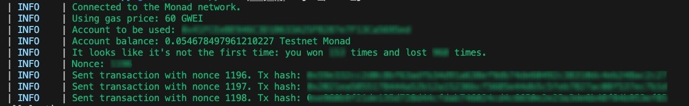

# FastLane Frontrunner Bot PYTHON

💡We also have a Golang version of the bot [Here](https://github.com/FastLane-Labs/break-monad-frontrunner-bot)

<p align="center">
  
</p>

The objective is simple, you compete as a searcher to be first to land a transaction on-chain in each new block.
Your ranking is determined by your win/loss ratio weighted by number of attempts - so you get some skin in the game.

<p align="center">
  
</p>


## How to run

⚠️ if you don't have Python installed, jump at Prerequisites

### Settings
1. Add your configuration:
Copy settings.toml.example to settings.toml and add your private key and rpc url

settings.toml
```toml
[api_settings]
rpc_url = 'your_rpc_url_here'

[eoa]
private_key = 'your_private_key_here'
```

```
London: https://rpc.monad-testnet-2.fastlane.xyz/b3qFoDfY9sR44yRyOeHAfyj9dpEXVoOC
Bogota: https://rpc.monad-testnet-3.fastlane.xyz/j6EsEZHfw9Iqrp7DUX5e1aLUk85d1Yzw
Singapore: https://rpc.monad-testnet-5.fastlane.xyz/FFHEYATiGl2Q83xOnf71ltrqZ57q9U1W
```

Contract Address:
```
0xBce2C725304e09CEf4cD7639760B67f8A0Af5bc4
```

⚠️ IMPORTANT SECURITY NOTES:
- Never share your private key or commit it to version control!
- Store your private key securely and keep a backup

### Run the bot

```sh
python play.py 
```
### Run the bot advanced mode

```sh
python play.py --gas_price_gwei 60 --attempts 1 --interval 5
```
If you do not enter any arguments, the bot will use the default values. If you do not enter `attempts` the bot will run indefinitely.

## Prerequisites

### 1. Install Python

First, you'll need to install Python on your computer:

#### Windows:
1. Download the installer from [Python's official website](https://www.python.org/downloads/)
2. Run the installer and follow the prompts
3. Open Command Prompt and verify installation:
```sh
python --version
```

#### Mac:
Using Homebrew:
```sh
brew install python
```

### 2. Install Python Dependencies

```sh
pip install -r requirements.txt
```
If something is missing:
```sh
pip install <package_name>
```

### 3. Generate a private key

You can generate a private key using the following command:
```sh
python generate_key_pair.py
```


## Need Help?

- Ask for help in the FastLane on Monad Discord (#frontunner channel)
- Talk to ChatGPT
- Create an issue in this repository


## License

MIT
